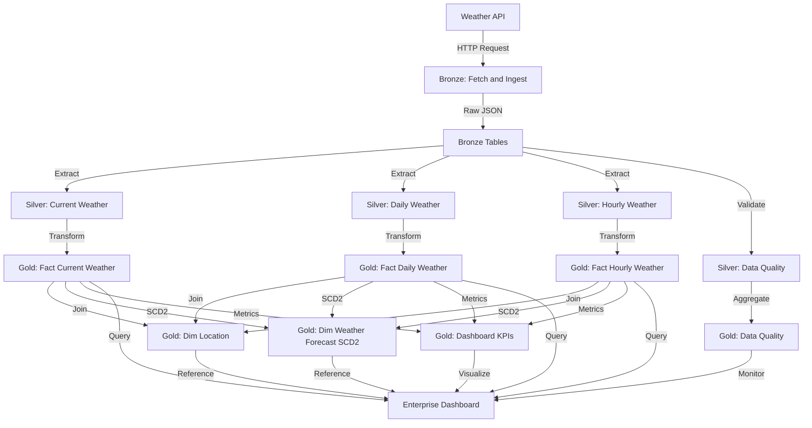

# Weather Forecast Data Pipeline


## 📊 Project Overview

This project implements a comprehensive weather forecasting data pipeline using the **Medallion Architecture** (Bronze, Silver, Gold) on Databricks. It ingests real-time weather data from external APIs for **21 major cities across the globe**, processes it through multiple transformation layers, and provides business-ready analytics through an interactive enterprise dashboard.

### 🌍 Monitored Cities
The pipeline currently tracks weather data for:
- **Indian Cities**: Delhi, Mumbai, Kolkata, Chennai, Bengaluru, Hyderabad, Ahmedabad, Pune, Jaipur, Lucknow, Patna, Bhopal, Bhubaneswar, Guwahati, Chandigarh
- **International Cities**: London, New York, Dubai, Singapore, Tokyo, Hanoi

---

## 🏗️ Architecture

### Medallion Architecture Layers

```
┌─────────────────────────────────────────────────────────────┐
│                     WEATHER DATA SOURCES                    │
│                    (External Weather APIs)                  │
└──────────────────────┬──────────────────────────────────────┘
                       │
                       ▼
┌─────────────────────────────────────────────────────────────┐
│                     BRONZE LAYER (RAW)                      │
│  ┌───────────────────────────────────────────────────────┐  │
│  │  • Fetch and Ingest weather data                      │  │
│  │  • Raw JSON data ingestion                            │  │
│  │  • Minimal transformation                             │  │
│  └───────────────────────────────────────────────────────┘  │
└──────────────────────┬──────────────────────────────────────┘
                       │
                       ▼
┌─────────────────────────────────────────────────────────────┐
│                   SILVER LAYER (CLEANED)                    │
│  ┌───────────────────────────────────────────────────────┐  │
│  │  • current_weather           • silver_daily_weather   │  │
│  │  • silver_hourly_weather     • silver_data_quality    │  │
│  │                                                       |  │
│  │  Data Cleaning & Standardization:                     │  │
│  │  - Schema validation                                  │  │
│  │  - Type casting                                       │  │
│  │  - Deduplication                                      │  │
│  │  - Data quality checks                                │  │
│  └───────────────────────────────────────────────────────┘  │
└──────────────────────┬──────────────────────────────────────┘
                       │
                       ▼
┌─────────────────────────────────────────────────────────────┐
│                 GOLD LAYER (BUSINESS-READY)                 │
│  ┌───────────────────────────────────────────────────────┐  │
│  │  FACT TABLES:                                         │  │
│  │  • gold_fact_current_weather                          │  │
│  │  • gold_fact_daily_weather                            │  │
│  │  • gold_fact_hourly_weather                           │  │
│  │                                                       │  │
│  │  DIMENSION TABLES:                                    │  │
│  │  • gold_dim_location                                  │  │
│  │  • gold_dim_weather_forecast_scd2                     │  │
│  │                                                       │  │
│  │  ANALYTICS:                                           │  │
│  │  • gold_dashboard_kpis                                │  │
│  │  • gold_data_quality                                  │  │
│  └───────────────────────────────────────────────────────┘  │
└──────────────────────┬──────────────────────────────────────┘
                       │
                       ▼
┌─────────────────────────────────────────────────────────────┐
│            ENTERPRISE WEATHER FORECAST DASHBOARD            │
│                    (Business Intelligence)                  │
└─────────────────────────────────────────────────────────────┘
```

---

## 📈 Data Flow Diagram

### 🔄 End-to-End Data Flow

This diagram shows the complete data flow from API ingestion through all transformation layers to the final dashboard:


*Complete data flow from Weather API ingestion through Bronze, Silver, Gold layers to the Enterprise Dashboard*

### Mermaid Diagram (Interactive)



---

## 🔄 Detailed Data Flow: API to Dashboard

### Step-by-Step Data Transformation

```
┌─────────────────────────────────────────────────────────────────────────────┐
│ STEP 1: API DATA INGESTION (BRONZE LAYER)                                   │
├─────────────────────────────────────────────────────────────────────────────┤
│                                                                             │
│  🌐 Open-Meteo API Calls                                                    │
│  ├─ Geocoding API: City → Latitude/Longitude                                │
│  │   Input:  {"name": "Delhi", "count": 1}                                  │
│  │   Output: {"latitude": 28.7041, "longitude": 77.1025, ...}               │
│  │                                                                          │
│  └─ Weather API: Coordinates → Weather Data                                 │
│      Input:  {lat: 28.7041, lon: 77.1025, forecast_days: 7}                 │
│      Output: {                                                              │
│        "current": {temp, humidity, wind_speed, ...},                        │
│        "hourly": [{hour_1}, {hour_2}, ... {hour_168}],                      │
│        "daily": [{day_1}, {day_2}, ... {day_7}]                             │
│      }                                                                      │
│                                                                             │
│  📥 Data Storage                                                            │
│  └─ Table: weather_forcast.bronze.weather_raw                               │
│     Format: Delta Lake                                                      │
│     Schema: Raw JSON with metadata (city, country, lat, lon, timestamp)     │
│     Mode: MERGE (UPDATE existing city OR INSERT new city)                   │
│                                                                             │
└─────────────────────────────────────────────────────────────────────────────┘
        │
        │ Extract & Parse JSON
        ▼
┌─────────────────────────────────────────────────────────────────────────────┐
│ STEP 2: DATA CLEANSING & STANDARDIZATION (SILVER LAYER)                     │
├─────────────────────────────────────────────────────────────────────────────┤
│                                                                             │
│  📊 Silver Transformations (3 Parallel Streams)                             │
│                                                                             │
│  ┌─────────────────────────────────────────────────────────────┐            │
│  │ A. Current Weather Processing                               │            │
│  │    Source: bronze.weather_raw → current field               │            │
│  │    Output: silver.current_weather                           │            │
│  │    Transforms:                                              │            │
│  │    • Flatten nested JSON structure                          │            │
│  │    • Cast temperature_2m → current_temp (float)             │            │
│  │    • Extract weather_code, humidity, wind_speed             │            │
│  │    • Add observation_timestamp                              │            │
│  └─────────────────────────────────────────────────────────────┘            │
│                                                                             │
│  ┌─────────────────────────────────────────────────────────────┐            │
│  │ B. Daily Weather Processing                                 │            │
│  │    Source: bronze.weather_raw → daily field                 │            │
│  │    Output: silver.daily_weather                             │            │
│  │    Transforms:                                              │            │
│  │    • Explode daily array (7 rows per city)                  │            │
│  │    • Parse temperature_2m_max/min, precipitation_sum        │            │
│  │    • Extract sunrise/sunset, UV index, weather_code         │            │
│  │    • Create forecast_date column                            │            │
│  └─────────────────────────────────────────────────────────────┘            │
│                                                                             │
│  ┌─────────────────────────────────────────────────────────────┐            │
│  │ C. Hourly Weather Processing                                │            │
│  │    Source: bronze.weather_raw → hourly field                │            │
│  │    Output: silver.hourly_weather                            │            │
│  │    Transforms:                                              │            │
│  │    • Explode hourly array (168 rows per city)               │            │
│  │    • Parse temperature, humidity, precipitation_probability │            │
│  │    • Extract wind_speed, cloud_cover, visibility            │            │
│  │    • Create forecast_datetime column                        │            │
│  └─────────────────────────────────────────────────────────────┘            │
│                                                                             │
│  ✅ Data Quality Checks                                                     │
│  └─ silver.data_quality                                                     │
│     • Null value detection                                                  │
│     • Schema validation                                                     │
│     • Range checks (temperature: -50 to 60°C, humidity: 0-100%)             │
│     • Duplicate detection                                                   │
│                                                                             │
└─────────────────────────────────────────────────────────────────────────────┘
        │
        │ Star Schema Modeling
        ▼
┌─────────────────────────────────────────────────────────────────────────────┐
│ STEP 3: BUSINESS-READY ANALYTICS (GOLD LAYER)                               │
├─────────────────────────────────────────────────────────────────────────────┤
│                                                                             │
│  🌟 Dimension Tables (Slowly Changing Dimension Type 2)                     │
│                                                                             │
│  ┌─────────────────────────────────────────────────────────────┐            │
│  │ gold.dim_location                                           │            │
│  │ • Generates surrogate key: location_id                      │            │
│  │ • Stores: city, country, latitude, longitude, timezone      │            │
│  │ • One row per unique city                                   │            │
│  └─────────────────────────────────────────────────────────────┘            │
│                                                                             │
│  ┌─────────────────────────────────────────────────────────────┐            │
│  │ gold.dim_weather_forecast_scd2                              │            │
│  │ • Tracks forecast changes over time (SCD Type 2)            │            │
│  │ • Columns: forecast_id, model_version, valid_from_date,     │            │
│  │            valid_to_date, is_current                        │            │
│  │ • Maintains historical accuracy of forecasts                │            │
│  └─────────────────────────────────────────────────────────────┘            │
│                                                                             │
│  📊 Fact Tables (Kimball Star Schema)                                       │
│                                                                             │
│  ┌─────────────────────────────────────────────────────────────┐            │
│  │ gold.fact_current_weather                                   │            │
│  │ • Foreign Keys: location_id, forecast_id                    │            │
│  │ • Measures: temperature, feels_like, humidity, wind_speed   │            │
│  │ • Grain: One row per city per observation time              │            │
│  └─────────────────────────────────────────────────────────────┘            │
│                                                                             │
│  ┌─────────────────────────────────────────────────────────────┐            │
│  │ gold.fact_daily_weather                                     │            │
│  │ • Foreign Keys: location_id, forecast_id                    │            │
│  │ • Measures: temp_max, temp_min, precipitation, UV index     │            │
│  │ • Grain: One row per city per forecast date (7 days)        │            │
│  └─────────────────────────────────────────────────────────────┘            │
│                                                                             │
│  ┌─────────────────────────────────────────────────────────────┐            │
│  │ gold.fact_hourly_weather                                     │           │
│  │ • Foreign Keys: location_id, forecast_id                     │           │
│  │ • Measures: temperature, precipitation_probability, cloud_cover│         │
│  │ • Grain: One row per city per hour (168 hours)              │            │
│  └─────────────────────────────────────────────────────────────┘            │
│                                                                             │
│  📈 Aggregate KPI Tables                                                    │
│                                                                             │
│  ┌─────────────────────────────────────────────────────────────┐            │
│  │ gold.dashboard_kpis                                         │            │
│  │ • Pre-computed metrics for dashboard performance            │            │
│  │ • Current temperature, humidity, wind speed                 │            │
│  │ • Weekly rainfall total, sunshine duration                  │            │
│  │ • Min/max temperature ranges                                │            │
│  └─────────────────────────────────────────────────────────────┘            │
│                                                                             │
│  ✅ gold.data_quality                                                       │
│     • Referential integrity checks                                          │
│     • Fact-dimension join validation                                        │
│     • SCD2 history validation                                               │
│                                                                             │
└─────────────────────────────────────────────────────────────────────────────┘
        │
        │ Dashboard Query & Visualization
        ▼
┌─────────────────────────────────────────────────────────────────────────────┐
│ STEP 4: BUSINESS INTELLIGENCE (DASHBOARD LAYER)                             │
├─────────────────────────────────────────────────────────────────────────────┤
│                                                                             │
│  📊 Enterprise Weather Forecast Dashboard (27 Datasets, 2 Pages)            │
│                                                                             │
│  Page 1: Real-Time Overview                                                 │
│  ├─ KPI Counters (from gold.dashboard_kpis)                                 │
│  │  • Current Temperature                                                   │
│  │  • Humidity %                                                            │
│  │  • Wind Speed                                                            │
│  │  • Weekly Rainfall                                                       │
│  │                                                                          │
│  ├─ Filters (from gold.dim_location)                                        │
│  │  • City Selector (21 cities)                                             │
│  │  • Date Picker                                                           │
│  │                                                                          │
│  └─ Visualizations                                                          │
│     • Temperature trends (gold.fact_current_weather)                        │
│     • Weather condition cards                                               │
│                                                                             │
│  Page 2: Advanced Analytics                                                 │
│  ├─ Multi-City Comparisons                                                  │
│  │  • Hourly temperature bar chart (gold.fact_hourly_weather)               │
│  │  • 7-day temperature forecast line chart (gold.fact_daily_weather)       │
│  │  • Rain probability area chart                                           │
│  │                                                                          │
│  ├─ Filters                                                                 │
│  │  • City & Country selectors                                              │
│  │  • Date range picker                                                     │
│  │                                                                          │
│  └─ Detailed Metrics                                                        │
│     • Cloud cover trends                                                    │
│     • UV index forecast                                                     │
│     • Sunrise/sunset times                                                  │
│                                                                             │
│  🔄 Dashboard Refresh Trigger                                               │
│  └─ Runs automatically after gold.dashboard_kpis task completes             │
│     Email notification sent to rohitsauro21@gmail.com                       │
│                                                                             │
└─────────────────────────────────────────────────────────────────────────────┘
```

---

## 🔀 Job Orchestration Flow

### Parent-Child Job Architecture

This section shows how the pipeline processes 21 cities in parallel using Databricks Jobs:

```
┌─────────────────────────────────────────────────────────────────────────────┐
│                    PARENT JOB: Weather_forcast_parent                       │
│                    Schedule: Daily at 6:00 AM IST                           │
├─────────────────────────────────────────────────────────────────────────────┤
│                                                                             │
│  📋 FOR_EACH_TASK: Process 21 Cities                                       │
│  Concurrency: 4 (Process 4 cities simultaneously)                          │
│                                                                             │
│  Cities Array:                                                              │
│  ["Delhi", "Mumbai", "Hanoi", "Kolkata", "Chennai", "Bengaluru",          │
│   "Hyderabad", "Ahmedabad", "Pune", "Jaipur", "Lucknow", "Patna",         │
│   "Bhopal", "Bhubaneswar", "Guwahati", "Chandigarh", "London",            │
│   "New York", "Dubai", "Singapore", "Tokyo"]                               │
│                                                                             │
│  Execution Flow:                                                            │
│  ┌────────────┐  ┌────────────┐  ┌────────────┐  ┌────────────┐          │
│  │ Batch 1    │  │ Batch 2    │  │ Batch 3    │  │ Batch 4    │          │
│  │ (4 cities) │  │ (4 cities) │  │ (4 cities) │  │ (4 cities) │          │
│  ├────────────┤  ├────────────┤  ├────────────┤  ├────────────┤          │
│  │ Delhi      │  │ Jaipur     │  │ Chandigarh │  │ Singapore  │          │
│  │ Mumbai     │  │ Lucknow    │  │ London     │  │ Tokyo      │          │
│  │ Hanoi      │  │ Patna      │  │ New York   │  │            │          │
│  │ Kolkata    │  │ Bhopal     │  │ Dubai      │  │            │          │
│  └─────┬──────┘  └─────┬──────┘  └─────┬──────┘  └─────┬──────┘          │
│        │               │               │               │                  │
│        └───────────────┴───────────────┴───────────────┘                  │
│                              │                                             │
│                              ▼                                             │
│              Each city triggers CHILD JOB                                  │
│                                                                             │
└─────────────────────────────────────────────────────────────────────────────┘
        │
        │ Trigger Child Job with city parameter
        ▼
┌─────────────────────────────────────────────────────────────────────────────┐
│                     CHILD JOB: Weather_forcast                              │
│                     Parameter: city = {{input}}                             │
├─────────────────────────────────────────────────────────────────────────────┤
│                                                                             │
│  📥 BRONZE LAYER                                                            │
│  ┌─────────────────────────────────────────────────────────────┐          │
│  │ Task: fetch_ingest                                           │          │
│  │ Notebook: Bronze/Fetch and Ingest weather data               │          │
│  │ Action: Call Open-Meteo API for specified city              │          │
│  │ Output: weather_forcast.bronze.weather_raw                   │          │
│  └─────────────────────────────────────────────────────────────┘          │
│                              │                                             │
│                              ▼                                             │
│  🔄 SILVER LAYER (3 Parallel Tasks)                                        │
│  ┌──────────────┐  ┌──────────────┐  ┌──────────────┐                    │
│  │current_      │  │silver_daily_ │  │silver_hourly_│                    │
│  │weather       │  │weather       │  │weather       │                    │
│  └──────┬───────┘  └──────┬───────┘  └──────┬───────┘                    │
│         │                 │                 │                              │
│         └─────────────────┼─────────────────┘                              │
│                           │                                                │
│                           ▼                                                │
│  🌟 GOLD LAYER (Star Schema Creation)                                     │
│  ┌─────────────────────────────────────────────────────────────┐          │
│  │ Task: gold_dim_location                                      │          │
│  │ Dependencies: current_weather                                │          │
│  └─────────────────────────────────────────────────────────────┘          │
│                              │                                             │
│                              ▼                                             │
│  ┌──────────────┐  ┌──────────────┐  ┌──────────────┐                    │
│  │gold_fact_    │  │gold_fact_    │  │gold_fact_    │                    │
│  │current_      │  │daily_        │  │hourly_       │                    │
│  │weather       │  │weather       │  │weather       │                    │
│  └──────┬───────┘  └──────┬───────┘  └──────┬───────┘                    │
│         │                 │                 │                              │
│         └─────────────────┼─────────────────┘                              │
│                           │                                                │
│                           ▼                                                │
│  ┌─────────────────────────────────────────────────────────────┐          │
│  │ Task: gold_dashboard_kpis                                    │          │
│  │ Dependencies: All fact tables                                │          │
│  │ Output: Pre-computed metrics for dashboard                   │          │
│  └─────────────────────────────────────────────────────────────┘          │
│                              │                                             │
│                              ▼                                             │
│  📊 DASHBOARD REFRESH                                                      │
│  ┌─────────────────────────────────────────────────────────────┐          │
│  │ Task: Dashboard                                              │          │
│  │ Type: dashboard_task                                         │          │
│  │ Action: Refresh Enterprise Weather Forecast Dashboard        │          │
│  │ Warehouse: 86c1e19296d0f3b7                                  │          │
│  │ Email: rohitsauro21@gmail.com                                │          │
│  └─────────────────────────────────────────────────────────────┘          │
│                                                                             │
│  ✅ DATA QUALITY (Optional - runs if enabled)                              │
│  ┌─────────────────────────────────────────────────────────────┐          │
│  │ Task: gold_data_quality                                      │          │
│  │ Dependencies: All gold tables                                │          │
│  │ Run Condition: AT_LEAST_ONE_SUCCESS                          │          │
│  └─────────────────────────────────────────────────────────────┘          │
│                                                                             │
└─────────────────────────────────────────────────────────────────────────────┘
```

### Execution Timeline Example

```
Time    Parent Job                          Child Jobs (Concurrent)
──────  ──────────────────────────────────  ─────────────────────────────────
06:00   Start for_each_task                 
06:00   Batch 1 starts (4 cities)          → Delhi, Mumbai, Hanoi, Kolkata
06:02   Batch 1 Bronze complete             
06:03   Batch 1 Silver processing           
06:04   Batch 2 starts (4 cities)          → Jaipur, Lucknow, Patna, Bhopal
06:05   Batch 1 Gold processing             
06:06   Batch 2 Silver processing           
06:07   Batch 1 Dashboard refresh           
06:08   Batch 3 starts (4 cities)          → Chandigarh, London, NY, Dubai
06:09   Batch 2 Gold processing             
06:10   Batch 3 Silver processing           
06:11   Batch 2 Dashboard refresh           
06:12   Batch 4 starts (4 cities)          → Singapore, Tokyo
06:13   Batch 3 Gold processing             
06:14   Batch 4 Silver processing           
06:15   Batch 3 Dashboard refresh           
06:17   Batch 4 Gold processing             
06:18   Batch 4 Dashboard refresh           
06:19   All cities complete                 ✅ Success email sent
06:20   Parent job complete                 
```

**Key Benefits:**
* **Parallel Processing**: 4 cities processed simultaneously
* **Efficient Resource Usage**: ~20 minutes for 21 cities instead of ~2 hours serial
* **Fault Tolerance**: If one city fails, others continue
* **Scalability**: Easy to add more cities to the array


---

## 🗄️ Entity Relationship Diagram (ERD)

```
┌─────────────────────────────────────────┐
│      gold_dim_location                  │
├─────────────────────────────────────────┤
│ 🔑 location_id (PK)                     │
│    city_name                            │
│    country_code                         │
│    latitude                             │
│    longitude                            │
│    timezone                             │
│    elevation                            │
│    created_date                         │
│    updated_date                         │
└──────────────┬──────────────────────────┘
               │
               │ 1:N
               │
               ├──────────────────────────────────────────────┐
               │                                              │
               ▼                                              ▼
┌──────────────────────────────────────┐    ┌──────────────────────────────────────┐
│   gold_fact_current_weather          │    │   gold_fact_daily_weather            │
├──────────────────────────────────────┤    ├──────────────────────────────────────┤
│ 🔑 weather_id (PK)                   │    │ 🔑 daily_weather_id (PK)             │
│ 🔗 location_id (FK)                  │    │ 🔗 location_id (FK)                  │
│ 🔗 forecast_id (FK)                  │    │ 🔗 forecast_id (FK)                  │
│    observation_time                  │    │    forecast_date                     │
│    temperature                       │    │    temp_max                          │
│    feels_like                        │    │    temp_min                          │
│    humidity                          │    │    temp_avg                          │
│    pressure                          │    │    precipitation                     │
│    wind_speed                        │    │    humidity_avg                      │
│    wind_direction                    │    │    wind_speed_max                    │
│    visibility                        │    │    sunrise_time                      │
│    weather_condition                 │    │    sunset_time                       │
│    weather_description               │    │    weather_summary                   │
│    clouds_percentage                 │    │    uv_index                          │
│    uv_index                          │    │    created_date                      │
│    created_date                      │    │    updated_date                      │
│    updated_date                      │    └──────────────────────────────────────┘
└──────────────┬───────────────────────┘              │
               │                                      │
               │                                      │
               └──────────────┬───────────────────────┘
                              │
                              │ N:1
                              ▼
               ┌──────────────────────────────────────┐
               │ gold_dim_weather_forecast_scd2       │
               ├──────────────────────────────────────┤
               │ 🔑 forecast_id (PK)                  │
               │    forecast_source                   │
               │    model_version                     │
               │    forecast_type                     │
               │    accuracy_score                    │
               │    valid_from_date                   │
               │    valid_to_date                     │
               │    is_current                        │
               │    created_date                      │
               └──────────────────────────────────────┘

┌──────────────────────────────────────┐
│   gold_fact_hourly_weather           │
├──────────────────────────────────────┤
│ 🔑 hourly_weather_id (PK)            │
│ 🔗 location_id (FK) ──────┐          │
│ 🔗 forecast_id (FK)       │          │
│    forecast_datetime      │          │
│    temperature            │          │
│    feels_like             │          │
│    humidity               │          │
│    pressure               │          │
│    wind_speed             │          │
│    wind_direction         │          │
│    precipitation_prob     │          │
│    precipitation_amount   │          │
│    weather_condition      │          │
│    clouds_percentage      │          │
│    visibility             │          │
│    created_date           │          │
│    updated_date           │          │
└──────────────────────────────────────┘
           │
           └────────────────────────────┐
                                        │ N:1
                                        │
                              (connects to gold_dim_location)


┌──────────────────────────────────────┐    ┌──────────────────────────────────────┐
│   gold_dashboard_kpis                │    │   gold_data_quality                  │
├──────────────────────────────────────┤    ├──────────────────────────────────────┤
│ 🔑 kpi_id (PK)                       │    │ 🔑 quality_check_id (PK)             │
│    kpi_name                          │    │    table_name                        │
│    kpi_value                         │    │    check_name                        │
│    kpi_category                      │    │    check_result                      │
│    calculation_date                  │    │    record_count                      │
│    target_value                      │    │    failed_count                      │
│    variance_percentage               │    │    success_rate                      │
│    created_date                      │    │    check_timestamp                   │
└──────────────────────────────────────┘    │    severity_level                    │
                                            │    error_details                     │
                                            │    created_date                      │
                                            └──────────────────────────────────────┘
```

**Relationships:**
* **gold_dim_location** (1) → (N) **gold_fact_current_weather**
* **gold_dim_location** (1) → (N) **gold_fact_daily_weather**
* **gold_dim_location** (1) → (N) **gold_fact_hourly_weather**
* **gold_dim_weather_forecast_scd2** (1) → (N) **gold_fact_current_weather**
* **gold_dim_weather_forecast_scd2** (1) → (N) **gold_fact_daily_weather**
* **gold_dim_weather_forecast_scd2** (1) → (N) **gold_fact_hourly_weather**

---

## 📁 Project Structure

```
Weather_Forcast/
├─ Simple_project/
│   ├─ Bronze/
│   │   └─ Fetch and Ingest weather data.ipynb
│   ├─ Silver/
│   │   ├─ current_weather.ipynb
│   │   ├─ silver_daily_weather.ipynb
│   │   ├─ silver_hourly_weather.ipynb
│   │   └─ silver_data_quality.ipynb
│   ├─ Gold/
│   │   ├─ gold_fact_current_weather.ipynb
│   │   ├─ gold_fact_daily_weather.ipynb
│   │   ├─ gold_fact_hourly_weather.ipynb
│   │   ├─ gold_dim_location.ipynb
│   │   ├─ gold_dim_weather_forecast_scd2.ipynb
│   │   ├─ gold_dashboard_kpis.ipynb
│   │   └─ gold_data_quality.ipynb
│   ├─ job.yml
│   └─ Enterprise Weather Forecast Dashboard
└─ README.md
```


```
Weather_Forcast/
│
├── Simple_project/
│   │
│   ├── Bronze/
│   │   └── Fetch and Ingest weather data.ipynb
│   │
│   ├── Silver/
│   │   ├── current_weather.ipynb
│   │   ├── silver_daily_weather.ipynb
│   │   ├── silver_hourly_weather.ipynb
│   │   └── silver_data_quality.ipynb
│   │
│   ├── Gold/
│   │   ├── gold_fact_current_weather.ipynb
│   │   ├── gold_fact_daily_weather.ipynb
│   │   ├── gold_fact_hourly_weather.ipynb
│   │   ├── gold_dim_location.ipynb
│   │   ├── gold_dim_weather_forecast_scd2.ipynb
│   │   ├── gold_dashboard_kpis.ipynb
│   │   └── gold_data_quality.ipynb
│   │
│   └── Enterprise Weather Forecast Dashboard
│
└── README.md
```

---

## 🚀 Getting Started

### Prerequisites
* [](https://databricks.com/)
* [Databricks CLI](https://docs.databricks.com/en/dev-tools/cli/index.html) (for automation, optional)
* Git (for CI/CD integration)
* Monitoring tools (built-in or custom)


* Databricks Workspace (AWS)
* Unity Catalog enabled
* Serverless Compute (auto-selected)
* Weather API credentials (e.g., OpenWeatherMap, WeatherAPI)

### Setup Instructions

1. **Clone the Repository**
   ```bash
   git clone <repository-url>
   ```

2. **Configure API Credentials**
   * Store your weather API key in Databricks Secrets
   * Update the Bronze layer notebook with your API endpoint

3. **Create Unity Catalog Schema**
   ```sql
   CREATE CATALOG IF NOT EXISTS weather_catalog;
   CREATE SCHEMA IF NOT EXISTS weather_catalog.bronze;
   CREATE SCHEMA IF NOT EXISTS weather_catalog.silver;
   CREATE SCHEMA IF NOT EXISTS weather_catalog.gold;
   ```

4. **Run the Pipeline**
   * Start with Bronze layer: Execute data ingestion
   * Proceed to Silver layer: Run all transformation notebooks
   * Complete with Gold layer: Execute all gold notebooks
   * Open the dashboard for visualization

---

## 📊 Data Pipeline Details

### Bronze Layer
* **Purpose**: Raw data ingestion from weather APIs
* **Format**: JSON (unmodified)
* **Frequency**: Real-time or scheduled (hourly/daily)
* **Storage**: Delta Lake tables

### Silver Layer
* **Purpose**: Cleaned and standardized data
* **Transformations**:
  - Data type conversions
  - Null handling
  - Deduplication
  - Schema validation
* **Quality Checks**: Automated data quality monitoring

### Gold Layer
* **Purpose**: Business-ready analytics tables
* **Data Model**: Star schema with:
  - **Fact Tables**: Weather observations (current, daily, hourly)
  - **Dimension Tables**: Location, Weather Forecast (SCD Type 2)
* **Features**:
  - Historical tracking with SCD2
  - Pre-aggregated KPIs
  - Data quality metrics

---

## 📊 Dashboard Features

The **Enterprise Weather Forecast Dashboard** provides:

* Real-time weather conditions
* 7-day and hourly forecasts
* Temperature trends and patterns
* Precipitation analysis
* Wind speed and direction visualization
* Location-based filtering
* Historical weather comparisons
* Data quality monitoring

### 📸 Dashboard Screenshots

#### Page 1: Advance analytics Weather Forecasting 
*Comprehensive forecasting view with hourly temperature trends, multi-city comparisons, and detailed weather metrics*


---

## 📸 Job Architecture Screenshots

### Parent Job: Multi-City Orchestrator


*Parent job using for_each_task pattern to orchestrate data collection for 21 cities with concurrency of 4*

**Key Features:**
* **Job Name**: Weather_forcast_parent
* **Schedule**: Daily at 6:00 AM IST
* **Cities Processed**: 21 (Delhi, Mumbai, Kolkata, Chennai, Bengaluru, Hyderabad, Ahmedabad, Pune, Jaipur, Lucknow, Patna, Bhopal, Bhubaneswar, Guwahati, Chandigarh, London, New York, Dubai, Singapore, Tokyo, Hanoi)
* **Parallel Processing**: 4 cities at a time
* **Email Notifications**: Configured for success and failure

### Child Job: Single City Pipeline


*Child job showing the complete data pipeline from Bronze → Silver → Gold → Dashboard*

**Pipeline Tasks:**
1. **Bronze Layer**: `fetch_ingest` - Ingest weather data from Open-Meteo API
2. **Silver Layer**: 
   * `current_weather` - Current weather conditions
   * `silver_daily_weather` - Daily forecasts (7 days)
   * `silver_hourly_weather` - Hourly forecasts (168 hours)
   * `silver_data_quality` - Data validation
3. **Gold Layer**:
   * `gold_dim_location` - Location dimension table
   * `gold_fact_current_weather` - Current weather fact table
   * `gold_fact_daily_weather` - Daily weather fact table
   * `gold_fact_hourly_weather` - Hourly weather fact table
   * `gold_dashboard_kpis` - Pre-computed KPIs
   * `gold_data_quality` - Quality metrics (optional)
4. **Dashboard**: Auto-refresh and email subscription

---

## 🔄 Data Quality Framework

### Silver Layer Quality Checks
* Schema validation
* Null value detection
* Duplicate record identification
* Range validation for numeric fields
* Timestamp consistency

### Gold Layer Quality Metrics
* Referential integrity validation
* Completeness checks
* Accuracy scoring
* Freshness monitoring
* SCD2 history validation

---

## 🔗 API Documentation

### Weather Data Ingestion
- **Sources:** REST APIs compliant with OpenWeatherMap/WeatherAPI format
- **Parameters:**
  - `city` (default: `delhi`) — settable via pipeline configuration
  - API Key — stored securely via Databricks Secrets
- **Sample cURL:**
  ```bash
  curl 'https://api.openweathermap.org/data/2.5/weather?q=delhi&appid=<API_KEY>'
  ```
- **Ingestion Schedule:** Daily at 6:00 AM IST (`44 0 6 * * ?`) per `job.yml`

### Example Data Model Creation (Bronze to Silver)
```python
# Bronze notebook - minimal transformation
df_raw = read_files('weather.json', format='json')
df_raw.write.format('delta').saveAsTable('weather_catalog.bronze.weather_raw')

# Silver notebook - cleansing, type casting
df_clean = (
  spark.table('weather_catalog.bronze.weather_raw')
  .selectExpr('cast(main.temp as float) as temperature', 'dt as observation_time', 'name as city', ...)
)
df_clean.write.format('delta').saveAsTable('weather_catalog.silver.weather_clean')
```
---

## ⚙️ Deployment Guide

1. Clone repo & configure Databricks Secrets (API keys)
2. Review or adjust pipeline config in [`job.yml`](Simple_project/job.yml)
3. Deploy pipeline:
   - Using Databricks UI for Job creation, or
   - Automate via Databricks CLI:
     ```bash
     databricks jobs create --json-file Simple_project/job.yml
     databricks jobs run-now --job-id <job_id>
     ```
4. Edit the parameter `city` if you want to change the forecast location

---

## 🧪 Testing Strategy
- Unit tests for PySpark data transformations (notebooks should include test cells or reference `/tests` if added)
- Data quality validation notebooks (see Gold/Silver `data_quality`)
- End-to-end test: Validate dashboard metrics match source input for a test city/date
- Recommend CI pipeline to lint/test code before deployment

---

## 🖥️ Monitoring & Observability
- **Job Runs:** Use Databricks Jobs UI to view logs and pipeline status
- **Email Alerts:** Pipeline is configured to notify `rohitsauro21@gmail.com` on success/failure
- **Data Quality Dashboards:** Notebooks in Gold/Silver process and report on data integrity
- **Lineage & Audit Logs:** Unity Catalog tracks data movement, access, and lineage

---

## 🚦 CI/CD Pipeline
- Use Git for version control; push to main triggers build
- Optional: Integrate with Databricks CLI or [Databricks Labs CI/CD templates](https://github.com/databricks/terraform-databricks-examples/tree/main/.github/workflows)
- Example pipeline:
  ```yaml
  name: Databricks Weather Forecast CI/CD
  on:
    push:
      branches: [ main ]
  jobs:
    build:
      runs-on: ubuntu-latest
      steps:
        - uses: actions/checkout@v2
        - name: Setup Python
          uses: actions/setup-python@v2
        - name: Lint & Test
          run: pytest tests/
        - name: Deploy to Databricks
          run: |
            databricks jobs create --json-file Simple_project/job.yml
            databricks jobs run-now --job-id ${{ secrets.DATABRICKS_JOB_ID }}
  ```

---

## 📋 Table Schemas (Summary)
- **Bronze.weather_raw:** All original API columns (see OpenWeatherMap docs)
- **Silver.weather_clean:** `temperature (float), observation_time (timestamp), city (string) ...`
- **Gold.fact & dim tables:** see ER diagram for schema; PK/FK marked and data types inferred from sample transformations

---

## ⚙️ Configuration Parameters
- `city` (default: delhi) — set in `job.yml`, passed to ingestion notebook(s)
- Schedule: `44 0 6 * * ?` (daily at 6:00 AM IST)
- `email_notifications` — on pipeline success/failure
- All notebooks referenced are under `Simple_project/<Layer>/<Notebook>`

---

## 🛠️ Technologies Used

* **Platform**: Databricks on Azure
* **Compute**: Serverless
* **Storage**: Delta Lake
* **Governance**: Unity Catalog
* **Languages**: Python, SQL
* **Architecture**: Medallion (Bronze-Silver-Gold)
* **Data Model**: Star Schema with SCD Type 2

---

## 📝 Best Practices Implemented

1. **Medallion Architecture**: Progressive data refinement
2. **Delta Lake**: ACID transactions and time travel
3. **SCD Type 2**: Historical dimension tracking
4. **Data Quality Gates**: Automated validation at each layer
5. **Star Schema**: Optimized for analytics queries
6. **Incremental Processing**: Efficient data updates
7. **Unity Catalog**: Centralized governance and security

---

## 🔐 Security & Governance

* Unity Catalog for data governance
* Row-level and column-level security
* API credentials stored in Databricks Secrets
* Audit logging enabled
* Data lineage tracking

---

## 📈 Performance Optimization

* Z-ordering on frequently filtered columns
* Partitioning by date for time-series data
* Caching for frequently accessed dimensions
* Optimized joins using broadcast hints
* Serverless compute for auto-scaling

---

## 🐛 Troubleshooting

### Common Issues

1. **API Rate Limiting**
   * Solution: Implement exponential backoff
   * Check API quota limits

2. **Data Quality Failures**
   * Review silver_data_quality notebook
   * Check gold_data_quality metrics

3. **SCD2 Issues**
   * Verify valid_from_date and valid_to_date logic
   * Ensure is_current flag is correctly set

---

## 📚 Additional Resources

* [Databricks Medallion Architecture](https://www.databricks.com/glossary/medallion-architecture)
* [Delta Lake Documentation](https://docs.delta.io/)
* [Unity Catalog Guide](https://docs.databricks.com/data-governance/unity-catalog/index.html)
* [SCD Type 2 Implementation](https://www.databricks.com/blog/2022/08/22/dimensional-modeling-dbt-duckdb-part-2-slowly-changing-dimensions.html)

---


## 🚀 Future Scope

- **Add More Cities:** Easily scale to hundreds or thousands of cities by extending the cities array in the parent job configuration.
- **Real-Time Streaming:** Ingest live weather data with streaming APIs and Lakeflow Spark Declarative Pipelines.
- **Personalized Alerts & Notifications:** Integrate user-defined weather alerts, severe weather notifications, and threshold-based triggers.
- **Air Quality & Environmental Expansion:** Add AQI, pollen, and other environmental factors to enrich insights.
- **Predictive Analytics & ML:** Enable forecasting models, anomaly detection, and seasonal trend analysis across cities.
- **Custom Dashboard Features:** Support city-to-city comparisons, interactive maps, historical tracking, and mobile-friendly visuals.
- **Open Data/API Integration:** Expose weather data for external consumption and allow open-source/community city contributions.
--- 

## 👥 Contributing

Contributions are welcome! Please:
1. Fork the repository
2. Create a feature branch
3. Commit your changes
4. Submit a pull request

---

## 📄 License

This project is licensed under the MIT License.

---

## 📧 Contact

For questions, support, or to request pipeline changes:
- Contact: rohitsauro21@gmail.com (owner)
- For bugs/suggestions: File an issue in the project repository or contact the data engineering team


---

**Built with ❤️ on Databricks**
